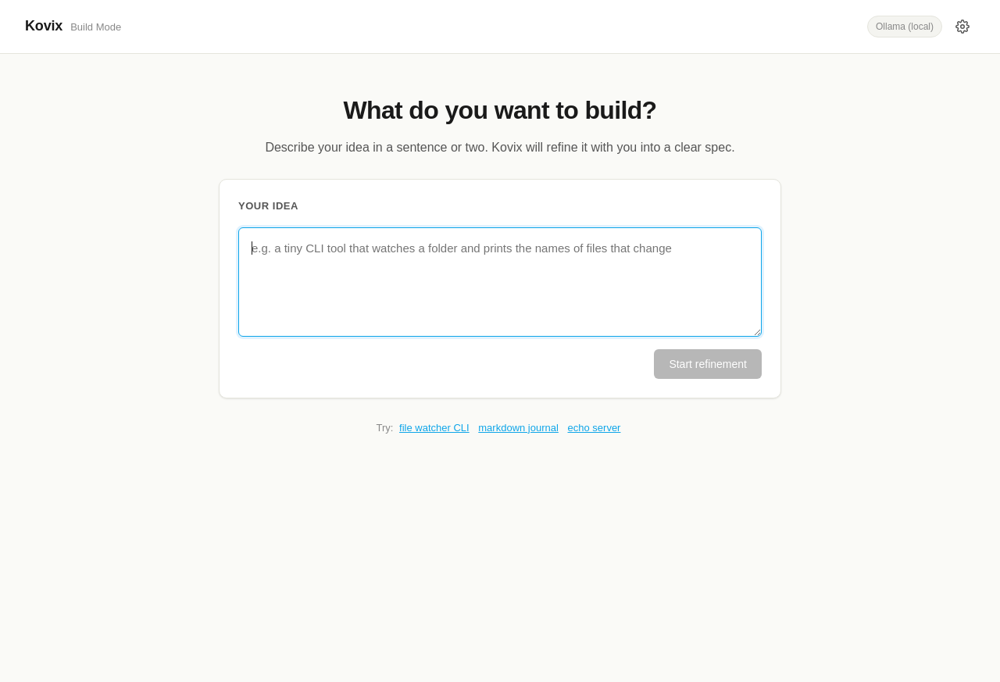
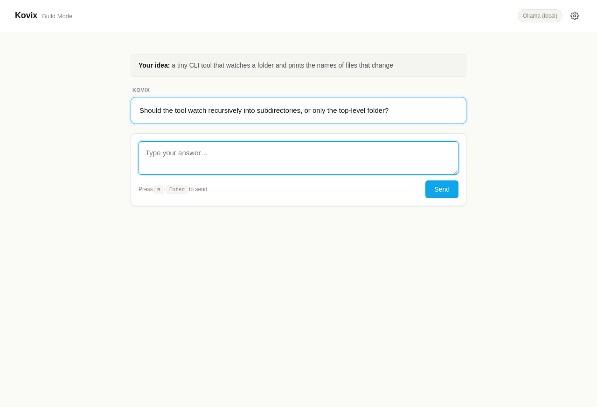
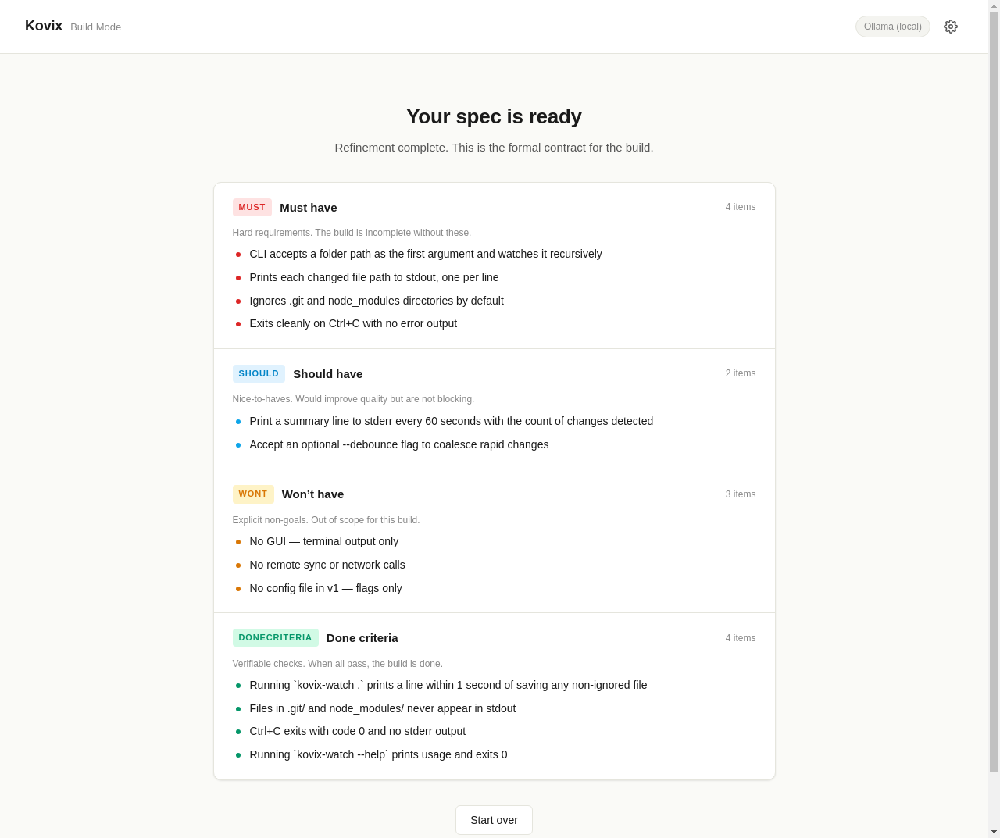
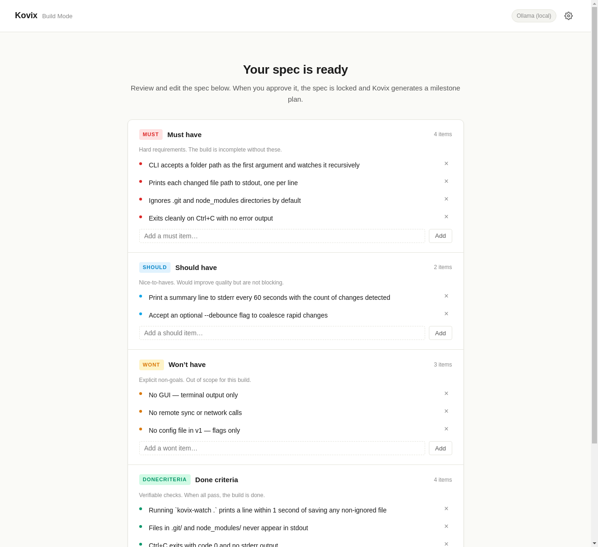
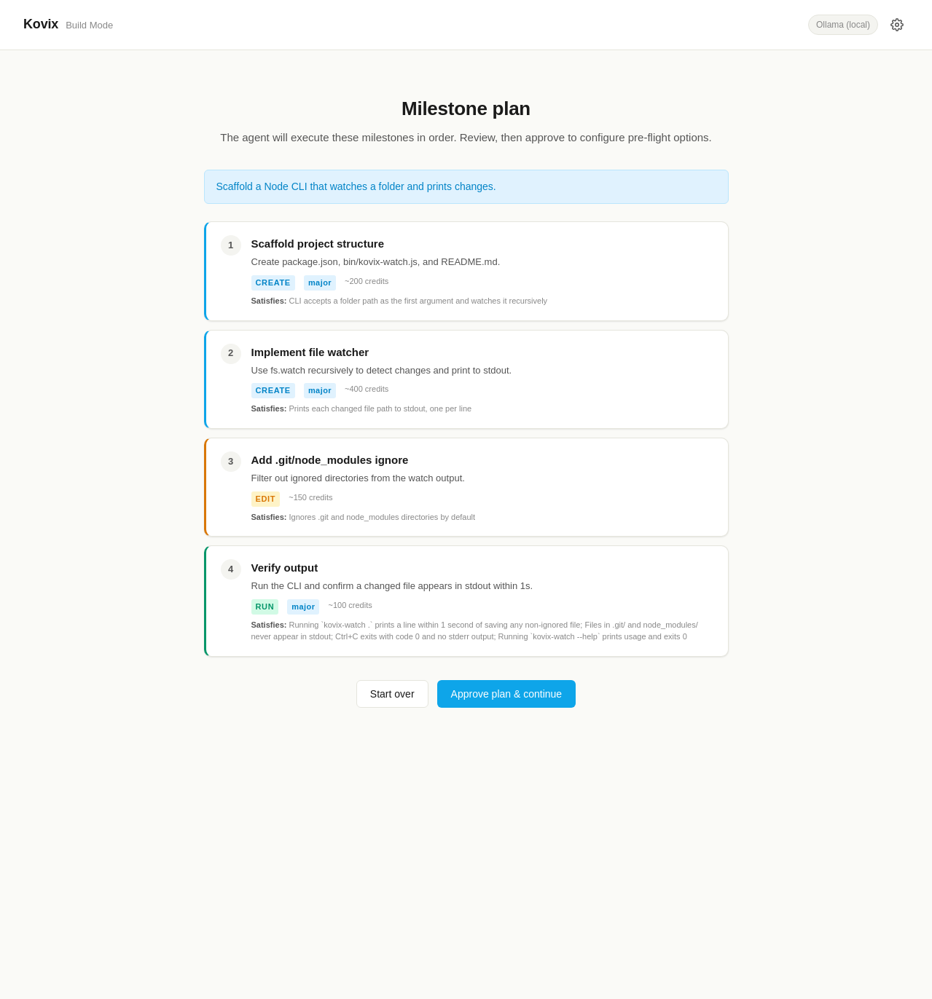
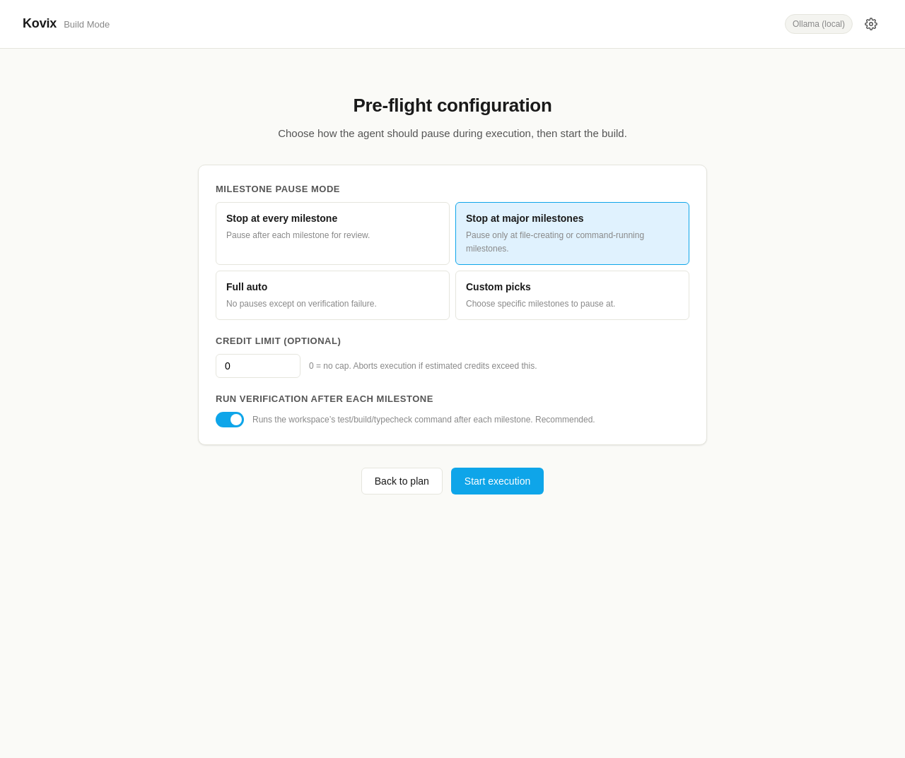
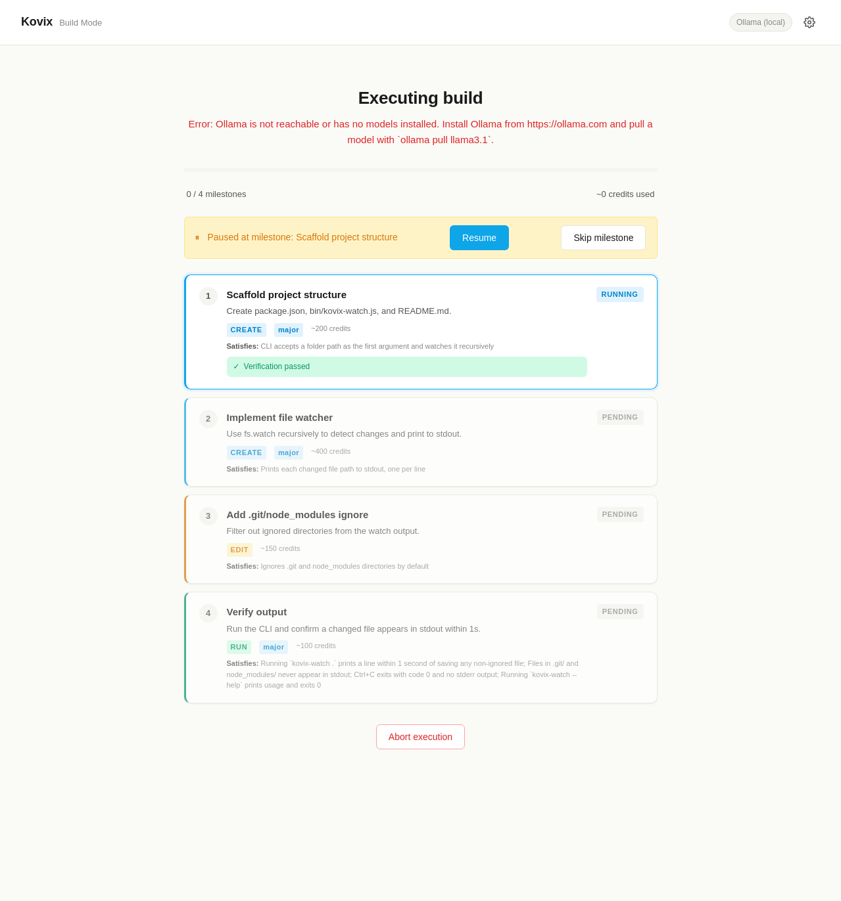
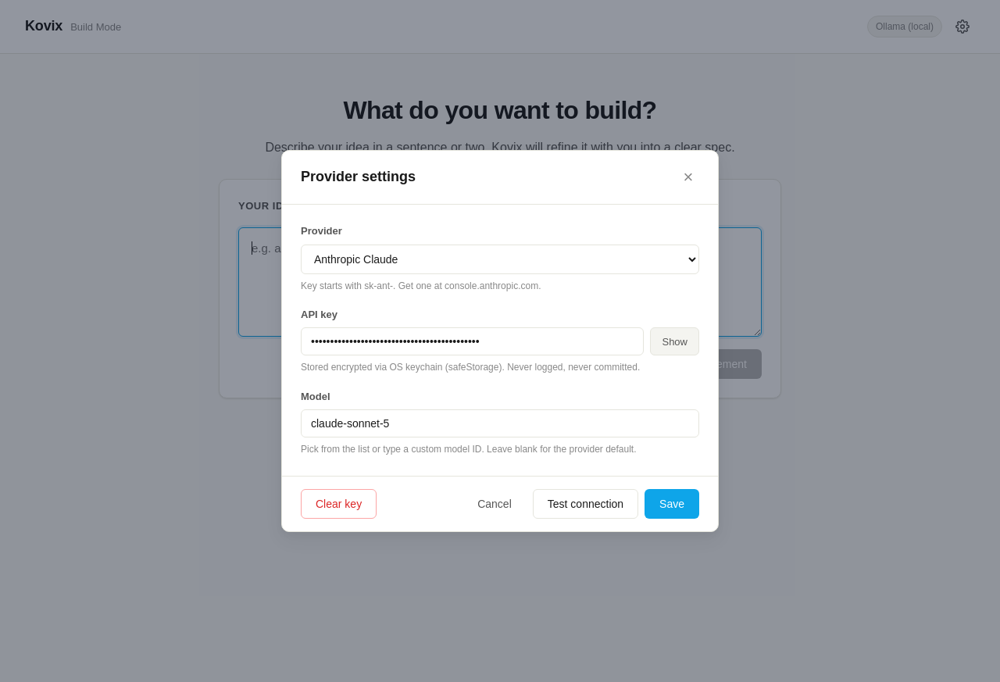

# Kovix

> Agent-first desktop build tool. You type an idea. Kovix refines it with you into a
> spec, plans the milestones, and an autonomous agent builds the files — pausing for
> approval at the gates you choose.

Kovix is **not** a VS Code fork. The agent core (LLM loop, planning, refinement, staging
layer, security checks, milestone state machine) was **extracted** from the Kovix_2.0 VS
Code extension and rewritten as a plain TypeScript module with constructor injection
instead of 22 DI dependencies. The shell around it is a brand-new standalone Electron
app: one main process, one preload bridge, one inline renderer that walks you through the
six Build-mode screens. There is no editor, no workspace concept, no extension host —
just the agent and the conversation you have with it.

The fastest mental model: **Kovix is to coding agents what a wizard is to a form**. Every
build goes through the same six stages with the same gates, so the agent never starts
writing files until you have approved a spec, approved a plan, and picked how often it
should pause.

---

## Status

**v1.0.0 — pre-alpha.** Verified paths work end-to-end with real LLM calls;
rough edges and missing features are documented honestly in
[LIMITATIONS.md](./LIMITATIONS.md). The v1.0.0 tag marks the first public
release of the standalone extraction; the agent core is stable, the shell is
functional, and the contract for contributors is fixed by the PolyForm
Noncommercial license.

What's verified:
- The **Anthropic Claude** provider path: idea → refinement → spec → plan → pre-flight →
  execute → done, with real LLM calls, real staged writes, real disk writes, real
  verification. Driven by `npm run verify:e2e`.
- The **Ollama** local provider: interface-level verified (status check + chat path
  ported verbatim from the VS Code fork).
- The **OpenRouter** provider: verified via free-tier models (rate-limited; see
  [PROVIDERS.md](./PROVIDERS.md) for caveats).
- The settings store: safeStorage encryption round-trip, masked preview, cleanup —
  driven by `npm run verify:settings`.

What's rough:
- The other 11 providers in the registry are interface-ready stubs but have not been
  exercised against a real API. See [PROVIDERS.md](./PROVIDERS.md).
- Sessions are in-memory only — close the window and the build state is gone (settings
  persist).
- The staging layer fires its approval event for the UI but auto-approves the actual
  disk write. There is no manual-approval diff view yet. See
  [LIMITATIONS.md](./LIMITATIONS.md#manual-approval-mode).
- The `verify:e2e` script is mechanically complete but has **not** been run with a real
  Anthropic key in the sandbox where this release was prepared. You must run it locally
  to confirm the full real-LLM path on your machine.

---

## The 6-stage Build mode flow

Every build walks through the same six stages. Each stage is a separate screen with a
single primary action; you cannot skip ahead.

```
  Idea  ->  Refinement  ->  Spec Approval  ->  Plan  ->  Pre-flight  ->  Execute  ->  Done
   |            |                |              |           |              |
   |            |                |              |           |              |
   you type    LLM asks         you edit       LLM emits   you pick       agent runs
   a one-      one question     {must,         milestones  pause mode     milestones,
   liner       at a time        should,        {id, name,  + credit cap   writes via
               until it has     wont,          satisfies,  + verify       staging layer
               enough to        doneCriteria}  estimatedC  toggle         (approval gate),
               emit a spec                      redits,                    pauses per
                                                type,                      preflight,
                                                isMajor}                   verifies
```

1. **Idea** — You type a one-line idea in a textarea. The placeholder gives examples
   ("a tiny CLI tool that watches a folder and prints the names of files that change").
   Click **Start refinement**. The screen is centered, single-column, ~720px wide.

   

2. **Refinement** — The LLM asks **exactly one** clarifying question per turn. You answer
   in 1-3 sentences; the LLM asks the next question. The service enforces a minimum of 3
   rounds and a hard cap of 5 before forcing finalization. The "one question per turn"
   rule is enforced both in the system prompt and by a server-side check that rejects
   multi-question responses. When the LLM has enough, it calls the `emit_spec` tool and
   the screen advances.

   

3. **Spec Approval** — The spec is shown as an editable 4-section card: **must** (hard
   requirements, red), **should** (nice-to-haves, blue), **wont** (non-goals, amber),
   **doneCriteria** (verifiable checks, green). You can edit any item inline, add new
   items, or remove items. Click **Approve spec & generate plan** to lock it. Once
   locked, the spec is immutable; the UI shows a green "approved and locked" banner.

   
   

4. **Plan** — The LLM generates a flat ordered list of milestones. Each milestone has an
   `id` (m1, m2, ...), `name`, `description`, `satisfies` (which spec requirements it
   covers, copied verbatim for mechanical coverage checking), `estimatedCredits` (rough
   token-cost estimate), `type` (Read / Create / Edit / Run), and `isMajor` (whether to
   pause in "stop at major" mode). The plan is shown as a stack of milestone cards with
   type-coded left borders. Click **Approve plan & continue**.

   

5. **Pre-flight** — You configure how the agent should run. Four pause modes:
   - **Stop at every milestone** — pause after each one for review (most visual, good for
     demos).
   - **Stop at major milestones** — pause only at file-creating or command-running
     milestones (default).
   - **Full auto** — no pauses except on verification failure.
   - **Custom picks** — choose specific milestone IDs to pause at.
   
   Plus an optional credit cap (0 = no cap; aborts if exceeded) and a verification toggle
   (runs `npm test` / `npm run build` / `npm run typecheck` after each milestone if a
   `package.json` is present). Click **Start execution**.

   

6. **Execute** — The agent runs the milestones in order. Each milestone card shows live
   status (pending / running / paused / completed / skipped / failed), an event log
   (tokens, tool calls, tool results, file writes), and verification output. When the
   agent pauses, a yellow banner appears with **Resume** and **Skip milestone** buttons.
   Files are written via the staging layer: the agent proposes a write, the approval
   callback fires, the file lands on disk in a per-build workspace under
   `os.tmpdir()/kovix-builds/build-<timestamp>/`. When all milestones complete, the
   screen advances to **Done**.

   

The **Done** screen shows a summary, the build directory path, and a **Start a new
build** button.

A stage indicator at the top of every screen shows where you are in the flow (six dots,
the current one highlighted, completed ones green).

The settings modal (gear icon, top-right) is where you configure your LLM provider,
API key, and model. The key is encrypted with safeStorage and never logged.



---

## Quick start

### Prerequisites

- **Node.js >= 20** (Kovix uses native ESM and modern `node:` imports).
- **npm** (ships with Node).
- **An LLM provider** — either an Anthropic API key (the verified path), an OpenRouter
  key, or a local Ollama install. See [PROVIDERS.md](./PROVIDERS.md) for the full list.

### Install and launch

```bash
git clone https://github.com/Razisafir/kovix-standalone.git
cd kovix-standalone
npm install
npm start
```

`npm start` runs `npm run build:bundle` (esbuild of main + preload to `dist/`) and then
`electron .`. The window opens on the Idea screen.

### First-run setup

The Idea screen shows a yellow **No provider configured** banner until you add a key. To
configure:

1. Click the **gear icon** in the top-right corner.
2. **Provider** dropdown: pick one (e.g. **Anthropic Claude**).
3. **API key**: paste your key. The field is password-masked with a **Show** toggle.
   The hint under the field confirms storage strategy: encrypted via OS keychain
   (safeStorage), never logged, never committed.
4. **Model**: pick from the dropdown list or type a custom model ID. Leave blank for the
   provider default.
5. **Base URL** (only shown for providers that support it): override the endpoint for
   local proxies or self-hosted instances.
6. Click **Test connection** — Kovix makes a minimal API call and shows a green "OK" or
   red "FAIL" result with the error message.
7. Click **Save**. The settings file is written to
   `app.getPath('userData')/kovix-settings.json` with mode `0600`. The key is encrypted
   with safeStorage (Keychain on macOS, DPAPI on Windows, libsecret on Linux); if
   safeStorage is unavailable, it falls back to plaintext with `0600` permissions and
   logs a warning.
8. Close the settings modal. The provider chip in the topbar now shows your provider +
   model. The yellow banner disappears.

You can change providers at any time — the build session is not affected (settings and
session are decoupled).

---

## Providers

Kovix ships with a **14-provider registry** in
[`src/agent/llm/providerFactory.ts`](./src/agent/llm/providerFactory.ts). All providers
implement the same `IConstructAIProvider` interface, so the refinement, planning, and
agent-loop code is provider-agnostic.

| Status | Providers |
|---|---|
| **Verified end-to-end** | anthropic, ollama, openrouter |
| **Interface-ready, untested** | openai, nvidia, together, groq, mistral, deepseek, gemini, lmstudio, litellm, xenova, custom |

Full per-provider details (default models, key requirements, offline support, caveats)
live in [PROVIDERS.md](./PROVIDERS.md). The short version: **use Anthropic Claude for the
most reliable experience**. OpenRouter works via free-tier models but rate-limits
unpredictably. Ollama works locally with no key. Everything else is a thin
`CloudProvider` wrapper that should work but has not been exercised against a real API.

To verify a provider yourself:

```bash
# Provider-specific verification (real LLM call, 8 checks):
npx tsx test/verify.ts --provider anthropic --api-key sk-ant-...

# Refinement loop verification:
npx tsx test/verify-refine.ts --provider anthropic --api-key sk-ant-...

# Settings-store-based verification (uses the key you saved in the UI):
npm run verify:settings

# Full Phase 2 e2e (uses the key you saved in the UI):
npm run verify:e2e
```

---

## Verification scripts

Kovix ships with four verification scripts. Each one runs a real LLM call against a real
provider and prints a transcript + a pass/fail verdict. They are the canonical way to
prove a code change didn't break the agent.

| Script | What it proves | Prerequisite |
|---|---|---|
| `npm run verify` (`test/verify.ts`) | The agent core runs standalone: instantiates, makes a real LLM call, gets a plan, the staging layer blocks the write, the approval callback fires, the file is NOT on disk before approval, the file IS on disk after approval with correct content, the complete event is received. 8 checks. | API key via env var (`ANTHROPIC_API_KEY` / `OPENROUTER_API_KEY` / `NVIDIA_API_KEY`) or `--provider`/`--api-key` flags. |
| `npm run verify:refine` (`test/verify-refine.ts`) | The refinement loop works end-to-end with a real LLM: each turn returns exactly one question, the LLM eventually calls `emit_spec`, the spec is real structured data (not string-parsed), all 4 arrays are populated. | Same as `verify`. |
| `npm run verify:settings` (`test/verify-settings.ts`) | The settings store works: safeStorage encryption round-trip, masked preview doesn't leak the key, cleanup removes the key. Spawns Electron with `KOVIX_VERIFY=1`. | You must have configured a provider via the UI first (`npm start` → gear → save). |
| `npm run verify:e2e` (`test/verify-end-to-end.ts`) | The full Phase 2 flow: Idea → Refinement → Spec approval → Plan → Pre-flight → Execute (real staged writes, real approval gate, real disk writes, real verification) → Done. Spawns Electron headless with `KOVIX_E2E_VERIFY=1`. 10 checks. | Same as `verify:settings`. **Not yet run with a real Anthropic key in the sandbox where this release was prepared — run it locally to confirm.** |

There is also `npm run verify:hello` — a convenience alias that runs `verify` with a
trivial "create a file called hello.txt with the text 'test' in it" task. Useful for
smoke-testing a provider quickly.

All scripts exit 0 on success and non-zero on failure, with specific exit codes for
common failure modes (1 = fatal, 2 = no provider config, 3 = refinement failed, 4 =
planning failed, 5 = execution failed). See the header comment of each script for the
full exit-code table.

---

## Architecture

Kovix is a standard Electron app with three process tiers:

- **Main process** (`src/main/`): `main.ts` (window lifecycle, IPC handlers, the inline
  renderer HTML, the e2e verification harness), `sessionStore.ts` (in-memory
  `BuildSession` type and the `defaultPreflightConfig` factory), `settingsStore.ts`
  (persistent provider config with safeStorage encryption, masked previews, env-var
  fallback), `testConnection.ts` (minimal LLM ping for the "Test connection" button).
- **Preload** (`src/preload/preload.ts`): a thin `contextBridge` that exposes a
  `kovixAPI` object to the renderer. The renderer never touches Node APIs directly.
- **Renderer** (inline `BUILD_MODE_HTML` in `main.ts`): a single-page app with seven
  sections (Idea, Refine, Spec, Plan, Preflight, Execute, Done) toggled by a `hidden`
  class. No framework, no build step — plain DOM manipulation.

The **agent core** lives in `src/agent/` and has zero Electron dependencies — it can be
imported and driven from a plain Node script (which is exactly what the `verify*`
scripts do):

- `agentLoop.ts` — the planning + execution LLM loop. Rewritten from a 1,947-line VS
  Code service with 22 DI deps into a 731-line class with constructor injection. The
  Anthropic SSE streaming parser, the system prompt (Iron Law of verification, Karpathy
  4 principles, Ponytail YAGNI ladder), and the verification harness are preserved
  verbatim.
- `planning/planningService.ts` — turns an approved spec into a milestone plan via a
  single `emit_plan` tool call. Server-side enforcement: rejects text-only responses,
  rejects empty milestone arrays, falls back to a synthesized plan if the LLM completely
  fails.
- `refinement/refinementService.ts` — turns a raw idea into a structured spec via a
  one-question-at-a-time dialogue. Enforces min/max turns, rejects premature
  `emit_spec` calls, rejects empty arrays.
- `llm/` — `cloudProvider.ts` (Anthropic + OpenAI-compatible SSE streaming),
  `ollamaProvider.ts` (local Ollama), `providerFactory.ts` (the 14-provider registry),
  `stubProviders.ts` (thin wrappers for the 11 unverified cloud providers),
  `types.ts` (the `IConstructAIProvider` interface).
- `staging/pendingChanges.ts` — the staging layer. Writes are held in memory until
  `applyStagedChange()` is called. This is the approval gate: the agent never writes to
  disk without going through it.
- `tools/` — `read_file`, `list_directory`, `search_codebase`, `web_search`,
  `write_file`, `edit_file`, `run_command`. Security checks (blocklist, rate limiter,
  interpreter approval, prompt sanitisation + secret redaction) are ported verbatim from
  the VS Code fork.
- `security/` — `secretPatterns.ts`, `promptSanitiser.ts`, `workspaceGuard.ts`,
  `terminalSecurity.ts`. Pure logic, no VS Code coupling.
- `milestoneExecutor.ts` + `milestoneStateMachine.ts` — the pause/resume state machine
  that drives Execute-screen behavior.

---

## License — PolyForm Noncommercial 1.0.0

Kovix is released under the **PolyForm Noncommercial License 1.0.0** — see
[LICENSE](./LICENSE). The short version:

- **You CAN** read, study, and run the code for personal learning, research,
  teaching, and non-commercial hobby projects.
- **You CAN** submit issues and open pull requests back to this repository.
- **You CAN** fork the repository to prepare a contribution back upstream.
- **You CANNOT** use Kovix, in whole or in part, for any commercial purpose,
  including: selling it, embedding it in a paid product or SaaS, hosting it as
  a managed service, or using it internally in a business where its output
  contributes to revenue.
- **You CANNOT** remove or alter the license or copyright notices.
- **You CANNOT** relicense the code or its derivative works under a more
  permissive license. Derivative works must remain under PolyForm
  Noncommercial 1.0.0.

This license is intentionally **not MIT**. Kovix is the product of substantial
work and the author wants to share it for learning and contribution while
keeping commercial exploitation exclusive. If you wish to use Kovix
commercially — for a paid product, an internal business tool, a hosted service,
or a training pipeline — you need a separate commercial license. Open an issue
titled `Commercial license inquiry` to start that conversation.

The above is a plain-language summary. The actual license terms are in
[LICENSE](./LICENSE); in any conflict, the LICENSE file controls.

---

## Contributing

This is pre-alpha software. PRs are welcome **under the same PolyForm
Noncommercial license as the rest of the project** — by submitting a PR you
agree your contribution will be licensed under PolyForm Noncommercial 1.0.0
with the same copyright attribution as the existing code. Please:

1. **Read [LIMITATIONS.md](./LIMITATIONS.md) first** — it lists what's
   intentionally missing and why. Don't open a PR for something already
   documented as a known limitation without discussing it first.
2. **Open an issue first** for anything beyond a bugfix or doc improvement.
   The roadmap is small and intentional; large unsolicited features will
   likely be declined.
3. **Run the verification scripts** before submitting. At minimum:
   `npm run verify:settings` (if you have a key configured) and
   `npm run typecheck`.
4. **Don't break the staging layer.** The approval gate is the security
   boundary. Any change that lets the agent write to disk without going
   through `PendingChanges` is a regression.
5. **Don't log API keys.** The settings store goes to considerable lengths to
   keep keys out of logs and out of the renderer. Don't undo that.
6. **Don't add a commercial feature.** Features whose primary purpose is
   commercial exploitation (paywalls, telemetry-for-hire, integration with
   paid SaaS as a paid offering) will be declined. If you want a commercial
   feature, see the **License** section above.

See [CONTRIBUTING.md](./CONTRIBUTING.md) for the full contributor guide,
[SECURITY.md](./SECURITY.md) for vulnerability reporting, and
[CHANGELOG.md](./CHANGELOG.md) for release history.
